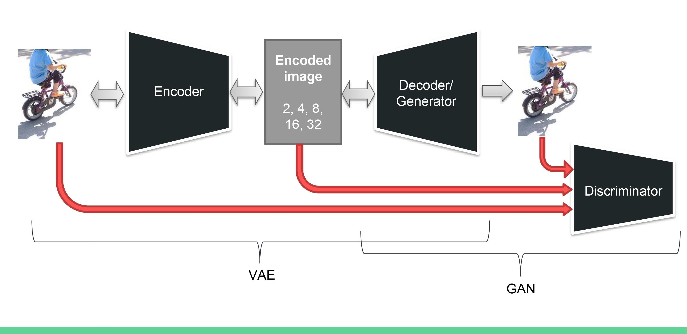
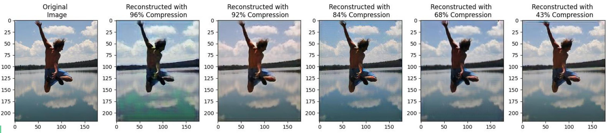

  [![Contributors][contributors-shield]][contributors-url] [![Forks][forks-shield]][forks-url] [![Stargazers][stars-shield]][stars-url] [![Issues][issues-shield]][issues-url] [![MIT License][license-shield]][license-url] [![LinkedIn][linkedin-shield]][linkedin-url]

<!-- PROJECT LOGO -->
<br />

<p align="center">
  <a href="https://github.com/vineeths96/Variational-Generative-Image-Compression">
    
  </a>
  <h3 align="center">Variational Generative Image Compression</h3>
  <p align="center">
    Image Compression using VAEGANs
    <br />
    <a href=https://github.com/vineeths96/Variational-Generative-Image-Compression><strong>Explore the repository»</strong></a>
    <br />
    <a href=https://github.com/vineeths96/Variational-Generative-Image-Compression/blob/master/docs/report.pdf>View Report</a>
  </p>

</p>

> tags : image compression, vaegans, gans, generative networks, flickr30k, deep learning, pytorch 


<!-- ABOUT THE PROJECT -->

## About The Project

In the modern world, a huge amount of data is being sent across the internet every day. Efficient data compression and communication protocols are of great research interest today. We focus on the compression of images and video (sequence of image frames) using deep generative models and show
that they achieve a better performance in compression ratio and perceptual quality. We explore the use of VAEGANs for this task. We know that generative models such as GANs and VAE can reproduce an image from its latent vector. We ask the question whether we can go the other direction — from an image to a latent vector. Research, though limited, has shown that these types of methods are quite effective and efficient. A detailed description of algorithms and analysis of the results are available in the [Report](./docs/report.pdf).


### Built With
This project was built with 

* python v3.8.5
* PyTorch v1.7
* The environment used for developing this project is available at [environment.yml](environment.yml).


<!-- GETTING STARTED -->

## Getting Started

Clone the repository into a local machine and enter the [src](src) directory using

```shell
git clone https://github.com/vineeths96/Variational-Generative-Image-Compression
cd Variational-Generative-Image-Compression/src
```

### Prerequisites

Create a new conda environment and install all the libraries by running the following command

```shell
conda env create -f environment.yml
```

The dataset used in this project (Flickr30K) will be automatically downloaded and setup in `input` directory during execution.

### Instructions to run

To train the model with *n* channels run,

```sh
python main.py --train-model True --num-channels <n> 
```

This trains the VAEGAN model and saves it in the `models` directory.

To evaluate the model on the compressed images run,

```sh
python main.py 
```

This generates a folder in the `results` directory for each run. The generated folder contains the compressed images using different number of channels. This also calculates the average PSNR and SSIM values across different runs, and generates `avg_psnr.txt` and `avg_ssim.txt` in the `results` directory.


## Model overview

The architecture of the model is shown below. We freeze the GAN model and optimize for the best latent vector using gradient descent.


<!-- RESULTS -->

## Results

We evaluate the models on the Structural Similarity Index (SSIM) and Peak Signal to Noise Ratio (PSNR) between the original image and reconstructed image. More detailed results and inferences are available in report [here](./docs/report.pdf).

| Number of Channel | SSIM | PSNR | CR |
| :------------------------------------------: | :-----------------: | :------------------------------------------: | :------------------------------------------: |
| 28 Channels | 0.83 | 24.79 | 1.74 × |
| 16 Channels | 0.80 | 24.37 | 3.06 × |
| 8 Channels | 0.81 | 24.06 |  6.12 ×  |
| 4 Channels | 0.79 | 23.57 |  12.24 ×  |
|     2 Channels     | 0.71 | 21.57 | 24.49 × |

Figure below compares the image quality of reconstruction for a sample image for different schemes.



<!-- LICENSE -->

## License

Distributed under the MIT License. See `LICENSE` for more information.


<!-- CONTACT -->
## Contact

Vineeth S - vs96codes@gmail.com

Project Link: [https://github.com/vineeths96/Variational-Generative-Image-Compression](https://github.com/vineeths96/Variational-Generative-Image-Compression)


<!-- MARKDOWN LINKS & IMAGES -->
<!-- https://www.markdownguide.org/basic-syntax/#reference-style-links -->

[contributors-shield]: https://img.shields.io/github/contributors/vineeths96/Variational-Generative-Image-Compression.svg?style=flat-square
[contributors-url]: https://github.com/vineeths96/Variational-Generative-Image-Compression/graphs/contributors
[forks-shield]: https://img.shields.io/github/forks/vineeths96/Variational-Generative-Image-Compression.svg?style=flat-square
[forks-url]: https://github.com/vineeths96/Variational-Generative-Image-Compression/network/members
[stars-shield]: https://img.shields.io/github/stars/vineeths96/Variational-Generative-Image-Compression.svg?style=flat-square
[stars-url]: https://github.com/vineeths96/Variational-Generative-Image-Compression/stargazers
[issues-shield]: https://img.shields.io/github/issues/vineeths96/Variational-Generative-Image-Compression.svg?style=flat-square
[issues-url]: https://github.com/vineeths96/Variational-Generative-Image-Compression/issues
[license-shield]: https://img.shields.io/badge/License-MIT-yellow.svg
[license-url]: https://github.com/vineeths96/Variational-Generative-Image-Compression/blob/master/LICENSE
[linkedin-shield]: https://img.shields.io/badge/-LinkedIn-black.svg?style=flat-square&logo=linkedin&colorB=555
[linkedin-url]: https://linkedin.com/in/vineeths

